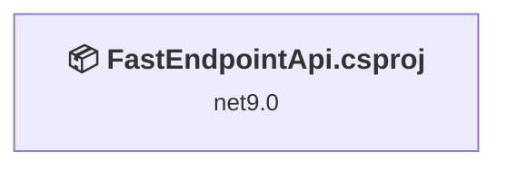
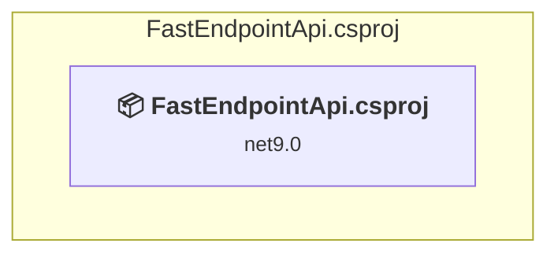

# Projects and dependencies analysis

This document provides a comprehensive overview of the projects and their dependencies in the context of upgrading to .NET 9.0.

## Table of Contents

- [Projects Relationship Graph](#projects-relationship-graph)
- [Project Details](#project-details)

  - [FastEndpointApi\FastEndpointApi.csproj](#fastendpointapifastendpointapicsproj)
- [Aggregate NuGet packages details](#aggregate-nuget-packages-details)

## Projects Relationship Graph

Legend:
📦 SDK-style project
⚙️ Classic project

## Project Details

### FastEndpointApi\FastEndpointApi.csproj

#### Project Info

- **Current Target Framework:** net9.0
- **Proposed Target Framework:** net10.0
- **SDK-style**: True
- **Project Kind:** AspNetCore
- **Dependencies**: 0
- **Dependants**: 0
- **Number of Files**: 23
- **Lines of Code**: 632

#### Dependency Graph

Legend:
📦 SDK-style project
⚙️ Classic project

#### Project Package References

| Package | Type | Current Version | Suggested Version | Description |
| :--- | :---: | :---: | :---: | :--- |
| Bogus | Explicit | 35.6.3 |  | ✅Compatible |
| FastEndpoints | Explicit | 6.2.0 |  | ✅Compatible |
| FastEndpoints.Attributes | Explicit | 6.2.0 |  | ✅Compatible |
| FastEndpoints.ClientGen.Kiota | Explicit | 6.2.0 |  | ✅Compatible |
| FastEndpoints.Swagger | Explicit | 6.2.0 |  | ✅Compatible |

## Aggregate NuGet packages details

| Package | Current Version | Suggested Version | Projects | Description |
| :--- | :---: | :---: | :--- | :--- |
| Bogus | 35.6.3 |  | [FastEndpointApi.csproj](#fastendpointapicsproj) | ✅Compatible |
| FastEndpoints | 6.2.0 |  | [FastEndpointApi.csproj](#fastendpointapicsproj) | ✅Compatible |
| FastEndpoints.Attributes | 6.2.0 |  | [FastEndpointApi.csproj](#fastendpointapicsproj) | ✅Compatible |
| FastEndpoints.ClientGen.Kiota | 6.2.0 |  | [FastEndpointApi.csproj](#fastendpointapicsproj) | ✅Compatible |
| FastEndpoints.Swagger | 6.2.0 |  | [FastEndpointApi.csproj](#fastendpointapicsproj) | ✅Compatible |

