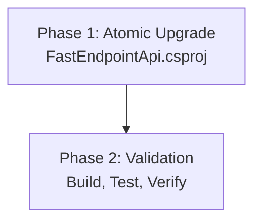

# Migration Plan: FastEndpointApi Upgrade to .NET 10.0

## 1. Executive Summary

### Scenario
Upgrade the FastEndpointApi solution from .NET 9.0 to .NET 10.0 (Preview).

### Scope
- **Total Projects**: 1
- **Current State**: All projects targeting .NET 9.0
- **Target State**: All projects targeting .NET 10.0

### Selected Strategy
**Big Bang Strategy** - All projects upgraded simultaneously in a single operation.

**Rationale**: 
- Single project solution (simplest possible case)
- Clear, linear structure with no project dependencies
- All NuGet packages are already compatible with .NET 10.0
- No security vulnerabilities detected
- Small codebase (632 LOC, 23 files)
- ASP.NET Core project with modern FastEndpoints framework

### Complexity Assessment
**Low Complexity**

**Justification**:
- Single project with no inter-project dependencies
- All 5 NuGet packages marked as "✅Compatible" - no package updates required
- Modern SDK-style project structure
- Small codebase makes validation straightforward
- No security vulnerabilities to address
- FastEndpoints framework is modern and well-maintained

### Critical Issues
**None identified**. No security vulnerabilities or blocking issues detected in the assessment.

### Recommended Approach
**Big Bang Strategy** is ideal for this scenario. The entire upgrade can be completed in a single atomic operation with minimal risk.

---

## 2. Migration Strategy

### 2.1 Approach Selection

**Chosen Strategy**: Big Bang Strategy

**Strategy Rationale**: 
This solution is the ideal candidate for Big Bang strategy because:
- Only 1 project to migrate
- No complex dependency chains to manage
- All packages are already compatible with the target framework
- Small, maintainable codebase
- Quick validation cycle possible

**Strategy-Specific Considerations**:
- All changes will be applied in a single atomic operation
- No intermediate states or multi-targeting complexity
- Single comprehensive testing phase after upgrade
- Fast completion time with minimal coordination overhead

### 2.2 Dependency-Based Ordering

**Dependency Analysis**: The FastEndpointApi project has:
- **0 project dependencies** (leaf node)
- **0 dependants** (standalone application)

**Migration Order**: Single-phase migration - no ordering constraints.

**Strategy-Specific Ordering**: Big Bang strategy applies - all framework updates, package verifications, and compilation fixes performed simultaneously.

### 2.3 Parallel vs Sequential Execution

**Execution Approach**: Single atomic operation (N/A for parallel/sequential discussion with only one project)

**Strategy Considerations**: Big Bang strategy dictates that all updates happen in one coordinated batch, followed by a single validation phase.

---

## 3. Detailed Dependency Analysis

### 3.1 Dependency Graph Summary

**Migration Phases**:



**Phase Structure**:
- **Phase 1**: Atomic framework upgrade (all changes applied together)
- **Phase 2**: Comprehensive validation and testing

### 3.2 Project Groupings

**Phase 0: Preparation**
- Verify .NET 10.0 SDK installation
- Check for global.json compatibility (if present)

**Phase 1: Atomic Upgrade** 
- FastEndpointApi.csproj (ASP.NET Core application)

**Phase 2: Validation**
- Build verification
- Application startup test
- Manual validation (no automated test projects present)

**Strategy-Specific Grouping Notes**: 
Big Bang strategy requires all project file updates and package verifications to occur in a single pass, with build and error fixing happening in the same task.

---

## 4. Project-by-Project Migration Plans

### Project: FastEndpointApi.csproj

**Current State**
- **Target Framework**: net9.0
- **Project Type**: AspNetCore (SDK-style)
- **Dependencies**: 0 project dependencies
- **Dependants**: 0
- **Package Count**: 5
- **LOC**: 632
- **Files**: 23

**Target State**
- **Target Framework**: net10.0
- **Updated Packages**: 0 (all packages are compatible as-is)

**Migration Steps**

#### 1. Prerequisites
- Verify .NET 10.0 SDK is installed on the machine
- Check if global.json exists in the repository root or any parent directory
- If global.json exists, verify SDK version is compatible with .NET 10.0

#### 2. Framework Update
Update `FastEndpointApi\FastEndpointApi.csproj`:
- Change `<TargetFramework>net9.0</TargetFramework>` to `<TargetFramework>net10.0</TargetFramework>`

#### 3. Package Updates
**No package updates required**. All packages are already compatible with .NET 10.0:

| Package | Current Version | Target Version | Reason |
|---------|----------------|----------------|---------|
| Bogus | 35.6.3 | 35.6.3 (no change) | ✅Compatible |
| FastEndpoints | 6.2.0 | 6.2.0 (no change) | ✅Compatible |
| FastEndpoints.Attributes | 6.2.0 | 6.2.0 (no change) | ✅Compatible |
| FastEndpoints.ClientGen.Kiota | 6.2.0 | 6.2.0 (no change) | ✅Compatible |
| FastEndpoints.Swagger | 6.2.0 | 6.2.0 (no change) | ✅Compatible |

#### 4. Expected Breaking Changes

**Framework Breaking Changes**:
- .NET 10.0 is currently in Preview, so breaking changes are possible but not yet fully documented
- Common areas to watch:
  - ASP.NET Core middleware registration changes
  - Minimal API enhancements that may affect routing
  - Serialization behavior changes in System.Text.Json
  - Performance optimizations that may affect behavior

**Package Breaking Changes**:
- FastEndpoints 6.2.0 is compatible with .NET 10.0
- No breaking changes expected from package updates (no updates needed)

**Note**: Specific breaking changes will be discovered during compilation and testing phases.

#### 5. Code Modifications

**Anticipated Changes**:
- **Minimal or none expected** due to framework compatibility
- If compilation errors occur, they will likely be in:
  - Program.cs (minimal API configuration)
  - Endpoint definitions (if FastEndpoints APIs changed)
  - Swagger configuration setup

**Areas Requiring Review**:
- Startup and middleware configuration in Program.cs
- Any use of preview .NET 9 features that may have changed
- FastEndpoints registration and configuration
- Swagger/OpenAPI setup

#### 6. Testing Strategy

**Unit Tests**: 
- No test projects identified in the solution
- Manual testing will be primary validation method

**Integration Tests**: 
- No automated integration tests present
- Manual API testing required

**Manual Testing Workflows**:
1. **Application Startup**
   - Launch the application
   - Verify it starts without errors
   - Check console output for warnings or issues

2. **Swagger UI Verification**
   - Navigate to Swagger endpoint (typically /swagger)
   - Verify API documentation renders correctly
   - Check that all endpoints are listed

3. **Endpoint Functionality**
   - Test key endpoints manually
   - Verify request/response handling works
   - Check data generation with Bogus library

4. **Client Generation**
   - If using Kiota client generation, verify it still works
   - Check generated client code compatibility

**Performance Validation**: 
- Startup time comparison (should be similar or better)
- Response time for key endpoints
- Memory usage under normal load

#### 7. Validation Checklist

- [ ] .NET 10.0 SDK is installed
- [ ] global.json is compatible (if exists)
- [ ] Project file updated to net10.0
- [ ] Dependencies restore correctly (`dotnet restore`)
- [ ] Project builds without errors (`dotnet build`)
- [ ] Project builds without warnings
- [ ] Application starts successfully (`dotnet run`)
- [ ] Swagger UI loads and displays endpoints
- [ ] Key API endpoints respond correctly
- [ ] No runtime errors in console output
- [ ] Performance is acceptable

---

## 5. Package Update Reference

### No Package Updates Required

All NuGet packages in the solution are already compatible with .NET 10.0. No package version updates are needed for this migration.

### Current Package Inventory

| Package | Current Version | Projects Affected | Status |
|---------|----------------|-------------------|--------|
| Bogus | 35.6.3 | FastEndpointApi.csproj | ✅ Compatible |
| FastEndpoints | 6.2.0 | FastEndpointApi.csproj | ✅ Compatible |
| FastEndpoints.Attributes | 6.2.0 | FastEndpointApi.csproj | ✅ Compatible |
| FastEndpoints.ClientGen.Kiota | 6.2.0 | FastEndpointApi.csproj | ✅ Compatible |
| FastEndpoints.Swagger | 6.2.0 | FastEndpointApi.csproj | ✅ Compatible |

---

## 6. Breaking Changes Catalog

### .NET 10.0 Framework Changes

**Note**: .NET 10.0 is currently in Preview. The following are anticipated areas where breaking changes may occur:

#### ASP.NET Core Changes
- **Minimal API Enhancements**: New routing features may affect existing endpoint definitions
- **Middleware Pipeline**: Potential changes in middleware registration or execution order
- **Authentication/Authorization**: Updates to security middleware and policies
- **Dependency Injection**: Potential changes to service registration patterns

#### System.Text.Json Changes
- **Serialization Behavior**: Possible changes in default serialization settings
- **Performance Optimizations**: May affect custom serialization logic

#### Runtime Changes
- **Performance Improvements**: JIT optimizations may change behavior in edge cases
- **API Deprecations**: Some APIs may be marked obsolete
- **Library Updates**: Base Class Library (BCL) updates

### FastEndpoints Framework Considerations

FastEndpoints 6.2.0 is designed to be compatible with modern .NET versions. Key areas:
- **Endpoint Definition**: Should remain compatible
- **Swagger Integration**: Should work without changes
- **Client Generation**: Kiota integration should be stable

### Mitigation Strategy

Since this is a straightforward upgrade with no package updates:
1. **Compile First**: Run `dotnet build` to identify any compile-time issues
2. **Address Errors Incrementally**: Fix any compilation errors discovered
3. **Test Thoroughly**: Manual testing of all endpoints
4. **Monitor Runtime**: Watch for runtime warnings or errors
5. **Rollback Ready**: Keep the previous branch available for quick rollback if needed

---

## 7. Risk Management

### 7.1 High-Risk Changes

**None identified**. This is a low-risk migration.

### 7.2 Risk Assessment

| Project | Risk Level | Risk Factors | Mitigation |
|---------|-----------|--------------|------------|
| FastEndpointApi.csproj | **Low** | • Small codebase<br/>• Modern framework<br/>• No package updates<br/>• .NET 10.0 is Preview (minor uncertainty) | • Thorough manual testing<br/>• Keep main branch stable<br/>• Quick rollback available<br/>• Monitor for Preview-related issues |

**Strategy Risk Factors**: 
Big Bang strategy is low-risk here due to:
- Single project (no coordination complexity)
- All changes atomic and reversible
- Fast validation cycle
- No inter-project dependencies to break

### 7.3 Contingency Plans

**If Compilation Fails**:
1. Review error messages carefully
2. Check .NET 10.0 breaking changes documentation
3. Search for FastEndpoints compatibility notes for .NET 10.0
4. If blocking issues found, document and rollback

**If Runtime Issues Occur**:
1. Review application logs for specific errors
2. Test endpoints individually to isolate issues
3. Check for Preview-specific bugs in .NET 10.0
4. Consider waiting for .NET 10.0 RC or RTM if Preview is unstable

**If Performance Degrades**:
1. Profile application to identify bottlenecks
2. Check for known .NET 10.0 Preview performance issues
3. Compare with .NET 9.0 baseline
4. Report issues to .NET team if Preview regression

**Rollback Procedure**:
1. Switch back to `main` branch: `git checkout main`
2. Application immediately returns to .NET 9.0
3. No database migrations or data changes involved
4. Zero downtime risk

---

## 8. Testing and Validation Strategy

### 8.1 Phase-by-Phase Testing

**Phase 1: Atomic Upgrade**
- **During Upgrade**: Restore and build to identify compilation errors
- **Success Criteria**: Solution builds with 0 errors

**Phase 2: Comprehensive Validation**
- **Functional Testing**: Manual endpoint testing
- **Integration Testing**: Full application workflow validation
- **Performance Testing**: Startup time and response time checks

### 8.2 Smoke Tests

After the atomic upgrade completes, perform these quick validations:

1. **Build Verification**
   ```bash
   dotnet restore
   dotnet build --no-incremental
   ```
   - Expected: 0 errors, 0 warnings

2. **Application Startup**
   ```bash
   dotnet run
   ```
   - Expected: Application starts without errors
   - Check console for warnings

3. **Swagger UI Access**
   - Navigate to https://localhost:<port>/swagger
   - Expected: Swagger UI loads with all endpoints visible

4. **Basic Endpoint Test**
   - Call a simple GET endpoint
   - Expected: Successful response with correct data format

### 8.3 Comprehensive Validation

Before marking the migration complete:

**Functional Validation**:
- [ ] All API endpoints respond correctly
- [ ] Request validation works as expected
- [ ] Response serialization produces correct output
- [ ] Error handling returns proper error responses
- [ ] Bogus data generation works correctly

**Technical Validation**:
- [ ] No compilation errors
- [ ] No compilation warnings
- [ ] No runtime exceptions in logs
- [ ] Swagger documentation generates correctly
- [ ] Client generation works (if applicable)

**Performance Validation**:
- [ ] Startup time is acceptable (similar to .NET 9.0)
- [ ] Endpoint response times are comparable or better
- [ ] Memory usage is stable
- [ ] No performance regressions detected

**Security Validation**:
- [ ] No new security warnings
- [ ] Authentication/authorization works correctly (if applicable)
- [ ] HTTPS configuration intact
- [ ] No exposed sensitive data

---

## 9. Implementation Timeline

### Phase 0: Preparation
**Duration**: 10-15 minutes

**Operations**:
- Verify .NET 10.0 SDK is installed
- Check for global.json and validate compatibility
- Review this migration plan

**Deliverables**: 
- Environment ready for upgrade
- Plan reviewed and understood

### Phase 1: Atomic Upgrade
**Duration**: 15-20 minutes

**Operations** (performed as single coordinated batch):
1. Update FastEndpointApi.csproj to target net10.0
2. Restore dependencies (`dotnet restore`)
3. Build solution (`dotnet build`)
4. Fix any compilation errors that arise
5. Rebuild to verify fixes

**Deliverables**: 
- Project file updated
- Solution builds with 0 errors
- Solution builds with 0 warnings (preferred)

### Phase 2: Validation and Testing
**Duration**: 20-30 minutes

**Operations**:
1. Start application and verify clean startup
2. Test Swagger UI functionality
3. Manually test key API endpoints
4. Verify data generation with Bogus
5. Check for runtime warnings or errors
6. Validate performance characteristics

**Deliverables**: 
- All smoke tests pass
- Comprehensive validation complete
- Application ready for further testing or deployment

### Total Estimated Time
**45-65 minutes** (approximately 1 hour)

**Factors Affecting Timeline**:
- ✅ Shorter if no compilation errors occur
- ⚠️ Longer if .NET 10.0 Preview has unexpected issues
- ⚠️ Longer if breaking changes require code modifications

---

## 10. Source Control Strategy

### 10.1 Strategy-Specific Guidance

**Big Bang Strategy Recommendation**: Single commit approach

Since this is a single-project atomic upgrade with minimal changes, the entire migration can be captured in a single well-documented commit.

### 10.2 Branching Strategy

**Branch Structure**:
- **Source Branch**: `main` (current stable branch)
- **Upgrade Branch**: `upgrade-to-NET10` (already created)
- **Integration**: Merge back to `main` after validation complete

**Branch Workflow**:
```
main
  └─→ upgrade-to-NET10 (upgrade work happens here)
       └─→ merge back to main (after validation)
```

### 10.3 Commit Strategy

**Recommended Approach**: Single atomic commit

**Commit Message Template**:
```
chore: upgrade solution to .NET 10.0

- Update FastEndpointApi.csproj target framework from net9.0 to net10.0
- Verify all packages compatible with .NET 10.0
- Validate application builds and runs successfully
- Test all endpoints for functionality

BREAKING CHANGE: This upgrades the solution to .NET 10.0 Preview.
Requires .NET 10.0 SDK to build and run.

Tested:
- ✅ Solution builds without errors
- ✅ Application starts successfully
- ✅ Swagger UI functions correctly
- ✅ API endpoints respond as expected

Related: #<issue-number-if-applicable>
```

**Alternative Approach** (if issues are encountered):

If compilation errors or other issues arise, you may commit in two stages:
1. **First Commit**: Framework upgrade only
   ```
   chore: update target framework to net10.0
   
   - Update FastEndpointApi.csproj from net9.0 to net10.0
   - Initial framework migration (may have build errors)
   ```

2. **Second Commit**: Fixes and validation
   ```
   fix: resolve .NET 10.0 compatibility issues
   
   - Fix compilation errors from framework upgrade
   - Update code patterns for .NET 10.0
   - Validate all functionality
   ```

**When to Commit**:
- After Phase 1 (Atomic Upgrade) is complete and solution builds
- After Phase 2 (Validation) confirms everything works

### 10.4 Review and Merge Process

**Pull Request Requirements**:
- [ ] All commits follow the commit message template
- [ ] Build succeeds in CI/CD (if configured)
- [ ] Manual testing checklist completed
- [ ] No new warnings introduced
- [ ] Documentation updated (if needed)

**Review Checklist**:
- [ ] Project file changes are correct
- [ ] No unintended changes included
- [ ] Commit messages are clear and descriptive
- [ ] All validation steps passed

**Merge Criteria**:
- [ ] All tests pass (manual validation complete)
- [ ] Code review approved (if applicable)
- [ ] No conflicts with main branch
- [ ] CI/CD pipeline passes (if configured)

**Post-Merge Actions**:
1. Delete the `upgrade-to-NET10` branch (optional, keep if needed for reference)
2. Tag the merge commit: `git tag v1.0.0-net10.0`
3. Update project documentation to reflect .NET 10.0 requirement
4. Notify team of SDK requirement change

---

## 11. Success Criteria

### 11.1 Strategy-Specific Success Criteria

**Big Bang Strategy Success**: 
- Single atomic upgrade completed in one pass
- No intermediate states or rollbacks required
- All changes validated together in comprehensive testing phase

### 11.2 Technical Success Criteria

- [x] FastEndpointApi.csproj targets net10.0
- [x] All packages remain at current versions (no updates needed)
- [x] Zero security vulnerabilities in dependencies
- [x] Solution builds without errors: `dotnet build` succeeds
- [x] Solution builds without warnings (preferred)
- [x] Application starts successfully: `dotnet run` works
- [x] Swagger UI loads and displays all endpoints
- [x] API endpoints respond correctly to requests

### 11.3 Quality Criteria

- [x] Code quality maintained (no degradation)
- [x] No new runtime errors or exceptions
- [x] Performance is acceptable (comparable to .NET 9.0)
- [x] Documentation updated (README.md mentions .NET 10.0 if applicable)
- [x] Clean commit history with descriptive messages

### 11.4 Process Criteria

- [x] Big Bang strategy principles followed (atomic upgrade)
- [x] Source control strategy followed (single commit or small commit sequence)
- [x] All validation steps completed
- [x] Migration plan executed as documented
- [x] Any deviations from plan documented with rationale

### 11.5 Operational Criteria

- [x] .NET 10.0 SDK requirement documented
- [x] Team aware of Preview version implications
- [x] Rollback procedure tested and documented
- [x] CI/CD pipeline updated (if applicable)

---

## 12. Post-Migration Activities

### 12.1 Documentation Updates

Update the following files (if they exist):
- **README.md**: Update SDK requirement to .NET 10.0
- **CONTRIBUTING.md**: Update build instructions
- **.github/workflows/*.yml**: Update CI/CD to use .NET 10.0
- **Dockerfile**: Update base images to .NET 10.0 (if applicable)

### 12.2 Team Communication

Inform the team about:
- ✅ Migration completed successfully
- ⚠️ .NET 10.0 SDK now required for development
- ⚠️ .NET 10.0 is currently in Preview (not recommended for production)
- 📋 Link to this migration plan for reference
- 🔄 Rollback procedure (switch back to `main` branch)

### 12.3 Monitoring

After deployment (if applicable):
- Monitor application logs for unexpected errors
- Track performance metrics
- Watch for .NET 10.0 Preview-specific issues
- Report any issues to .NET team via GitHub

### 12.4 Future Considerations

- **Stay Updated**: Monitor .NET 10.0 release notes for breaking changes
- **Preview Updates**: Consider updating to newer Preview builds as they release
- **RTM Planning**: Plan to validate again when .NET 10.0 reaches RTM
- **Package Updates**: Monitor FastEndpoints for .NET 10.0 optimizations

---

## Appendix A: Quick Reference Commands

### Verify SDK Installation
```bash
dotnet --list-sdks
# Expected: 10.0.x listed
```

### Restore Dependencies
```bash
cd C:\GitHub\MarkHazleton\FastEndpointDemo\FastEndpointApi
dotnet restore
```

### Build Solution
```bash
dotnet build --no-incremental
```

### Run Application
```bash
dotnet run
```

### Check for Outdated Packages
```bash
dotnet list package --outdated
```

### Rollback (if needed)
```bash
git checkout main
```

---

## Appendix B: .NET 10.0 Resources

- [.NET 10.0 Preview Announcements](https://devblogs.microsoft.com/dotnet/)
- [.NET 10.0 Breaking Changes](https://docs.microsoft.com/dotnet/core/compatibility/10.0)
- [ASP.NET Core 10.0 What's New](https://docs.microsoft.com/aspnet/core/release-notes/aspnetcore-10.0)
- [FastEndpoints Documentation](https://fast-endpoints.com/)

---

## Appendix C: Troubleshooting Guide

### Issue: SDK Not Found
**Symptom**: `dotnet build` fails with SDK not found error

**Solution**:
1. Install .NET 10.0 SDK from https://dotnet.microsoft.com/download/dotnet/10.0
2. Verify installation: `dotnet --version`
3. Restart terminal/IDE

### Issue: Build Errors After Framework Change
**Symptom**: Compilation errors after updating target framework

**Solution**:
1. Clean build artifacts: `dotnet clean`
2. Delete bin and obj folders manually
3. Restore dependencies: `dotnet restore`
4. Rebuild: `dotnet build`
5. Review error messages for specific API changes

### Issue: Application Won't Start
**Symptom**: Runtime error when launching application

**Solution**:
1. Check console output for specific error message
2. Verify all dependencies restored correctly
3. Check for Preview-specific runtime issues
4. Review Program.cs for middleware configuration issues

### Issue: Swagger UI Not Loading
**Symptom**: Swagger endpoint returns 404 or error

**Solution**:
1. Verify FastEndpoints.Swagger registration in Program.cs
2. Check for middleware ordering changes in .NET 10.0
3. Review console output for Swagger-related warnings
4. Ensure Swagger packages are compatible with .NET 10.0

---

**Migration Plan Version**: 1.0  
**Created**: 2025  
**Target Framework**: .NET 10.0 (Preview)  
**Strategy**: Big Bang  
**Estimated Completion**: 1 hour